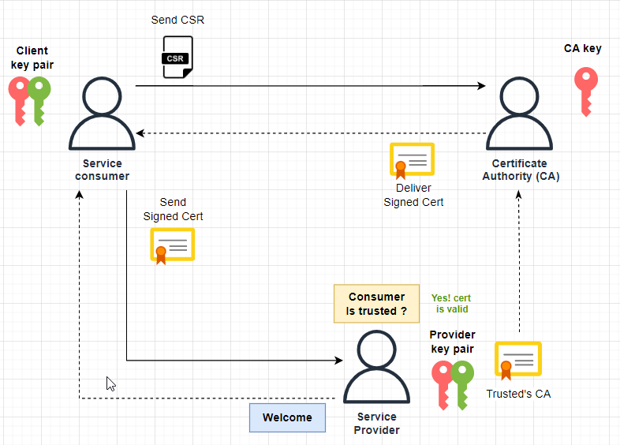
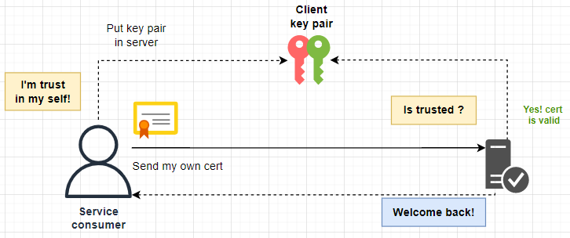

# jaxws-cert-auth-demo

This is a demo project to show how to publish a web service using SSL certificate authentication with JAX-WS over https protocol, including the java client to consume the service.

## Requirements

- Oracle Java JDK 64-Bit Server VM +**1.8.0_221**
- Apache maven +**3.6.3**
- Key pair (Self Signed or Signed by third party CA)

## Configuration


| **Resource**          | **Location**                    | **Description**                            |
|:----------------------|:--------------------------------|:-------------------------------------------|
| `pom.xml`             | keystore-gen                    | Keystore generated by mvn plugin           |
| `server.jks`          | keystore-gen/src/main/resources | Module to create self signed certification |
| `logaback-test.xml`   | jaxws-client/src/test/resources | logger configuration                       |
| `client-handlers.xml` | jaxws-client/src/main/resources | Web service handler chain configuration    |
| `logaback-test.xml`   | jaxws-server/src/test/resources | logger configuration                       |
| `server-handlers.xml` | jaxws-server/src/main/resources | Web service handler chain configuration    |


## Build

### Creating the keystore and the certificates

A keystore file must be provided, but this project creates one by default using the keytool-maven-plugin. In this demo the certificates must be signed, you can use a Self Signed Certificate or sign your own certificate by third party CA. If you want to create manually choose one of the next methods.

**Method 1: Create keypair and client certificate signed by a third party CA**



```shell
# Create a Certificate Authority (CA)

openssl genrsa -out rootCA.key 2048
openssl req -new -x509 -days 9999 -key rootCA.key -out rootCA.pem

# Generate the server key pair and import CA certificate

keytool -genkeypair -alias dummyserver -keyalg RSA -keysize 2048 -validity 3650 -dname "CN=Dummy Server,OU=IT dummy,O=Dummy Server,L=MX,ST=CDMX,C=MX" -keypass changeit -keystore server.jks -storepass changeit -deststoretype pkcs12
keytool -importcert -alias DummyCA -file rootCA.pem -keystore server.jks -storepass changeit -noprompt

# Generate client key pair and Certificate Signing Request (CSR)

keytool -genkeypair -alias client-keystore -keyalg RSA -keysize 2048 -validity 3650 -dname "CN=localhost,O=dummyC1.com" -ext SAN=DNS:localhost -keypass changeit -keystore client-keystore.jks -storepass changeit -deststoretype pkcs12
keytool -certreq -alias client-keystore -keystore client-keystore.jks -file client.csr -storepass changeit

# Sign the certificate and validate

openssl x509 -req -days 365 -in client.csr -CA rootCA.pem -CAkey rootCA.key -set_serial 01 -out client.crt
openssl verify -CAfile rootCA.pem client.crt

# Import client.csr into client-keystore.jks, there is no command, please use a graphic tool like KSE explorer

```

**Method 2: Create a Self Signed Certificate**



```shell
# Creating a Self Signed Certificate

keytool -genkeypair -alias dummy_scc -keyalg RSA -keysize 2048 -validity 3650 \
-dname "CN=Dummy SSC,OU=IT dummy,O=Dummy SSC,L=MX,ST=CDMX,C=MX" \
-ext SAN=DNS:localhost -keypass changeit -keystore server.jks \
-storepass changeit -deststoretype pkcs12
```

### Compile and test

```bash 
# Execute unit tests
mvn clean test 

# Excute unit tests with code coverage report
mvn clean -p jacoco

# Create the keystore (executed as maven goal in generate-resources by default)
cd keystore-gen
mvn keytool:generateKeyPair
```

## Release

According do you need, use one of the next commands. Please, note that it could do some changes in the repository. 

```bash
# Clean files before to publish
mvn release:clean -P scm-release

# Update project versions in pom files
mvn release:update-versions P scm-release

# Publish version in simulation mode 
mvn release:prepare -P scm-release -DskipTests  \
-Darguments="-DskipTests -DpushChanges=false -DdryRun=true -DdeveloperConnectionUrl=scm:git:${git.repo.url}"

# Publish version in interactive mode
mvn release:prepare -P scm-release -DskipTests  \
-Darguments="-DskipTests -DdryRun=false -DdeveloperConnectionUrl=scm:git:${git.repo.url}"

# Publish version in non interactive example
mvn release:prepare -P scm-release \
-DdryRun=false \
-DdevelopmentVersion=1.0.5-SNAPSHOT \
-DreleaseVersion=1.0.5 \
-Dtag=v1.0.5 \
-DdeveloperConnectionUrl="scm:git:${git.repo.url}"
```

---

<p align="center">
  
</p>

License
-------

This project is copyright by **Orbital Zero**, it is free software and may be redistributed under the terms specified in the `LICENSE` file.

The names and logos for this sample code are trademarks of their respective owners, which are in no way associated or affiliated with **Orbital Zero**. Product names and logos are used solely for the purpose to show specific examples of software development, not for commercial use. Use of these names does not imply any co-operation or endorsement.